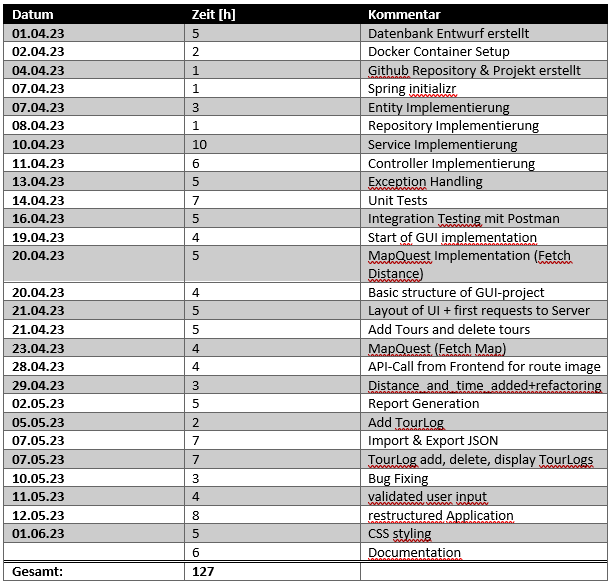

# SWE2-TourPlanner

## Requirements

* PostgreSQL Database     
  Can be done through docker

* Filled out properties    
  In the application.properties File following parameters should be changed before running the application.  
  --->Url: the url of the PostgreSQL-Database should be modified 
  --->username: the username for the Database 
  --->password: the password for accessing the Database 

## Database Setup Docker

1. Startup Docker and go to the command line
2. Enter following command to build and run the container: docker run --name swe2db -e POSTGRES_PASSWORD=swe2pw -p 5432:5432 -d postgres
3. Enter: "docker exec -it swe2db bash" 
4. Enter: "psql -U postgres" so you can enter psql commands
5. Now create a new database: "CREATE database tourplanner;"

You can alternatively change username, password, containername and so on. Just consider changing them in the properties file 
as well.

There's no need to create tables, because Spring Boot automatically creates these through the Entities. 

## 🛠 Build 

Build the application with Maven.

## 🚀 Run

Run with Maven

## Endpoints

All the functional Endpoints are described in the openapi.yaml File.

## 🧾 Protocol

### App Architecture

### Class Diagram

### Unit Test Design

The Unit Test were designed in a bottom up approach. Which means tests are designed for each layer except the Repositories.
Since the repositories should have already been tested by spring. Thus, tests were implemented for the Controllers and
Services.

The Services are the first layer which gets tested. Therefore, we mocked the repository with mockito. The tests are
structured in a given, when, then manner. Given states the initial data used for the test. When covers the part were
something gets called. Then checks if the correct method got called and if the arguments are right.

The Controller tests build upon the same approach. The only difference here is, that we are using the WebMvcTest library from
spring. This library can perform Http Requests, which are used to test our controllers. This way we can test all of our endpoints
and check the different response contents.

### Time Tracking

### Lessons Learned

1. Planning is crucial: Take the time to thoroughly plan and define the scope of your project before diving into development. Clearly outline the features and functionalities you want to include in the application. This will help you stay focused and organized throughout the development process.
2. Understanding the requirements: Spend sufficient time understanding and documenting the requirements of your project. A clear understanding of the requirements will prevent misunderstandings and rework in later stages of development.

### Link to git

https://github.com/grumartin/TourPlanner
